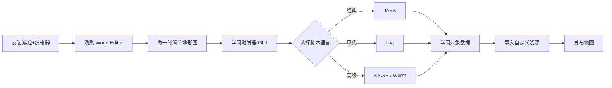

# 00 · 入门

新手上路与开发环境搭建。

## 文档列表

- [`环境搭建.md`](环境搭建.md) — 安装游戏、World Editor、第三方工具链
- [`第一个地图.md`](第一个地图.md) — 从零创建并运行一张自定义地图
- [`术语表.md`](术语表.md) — War3 mod 常用术语中英对照

## 学习路径建议

## 要点

1. **先玩后做**：熟悉游戏机制（英雄、技能、物品、护甲类型）是设计地图的前提。
2. **GUI 优先**：即使最终要写代码，先用触发器编辑器（GUI）理解事件-条件-动作模型。
3. **Lua vs JASS**：
   - 经典版（≤1.27）只有 JASS。
   - Reforged 1.31+ 支持 Lua，语法现代、性能更好、支持面向对象。
   - 新项目推荐 **Lua**；维护老地图用 **JASS / vJASS**。
4. **版本兼容**：Reforged 地图默认不向后兼容经典版，需在 `war3map.w3i` 设置合适的编辑器版本。
