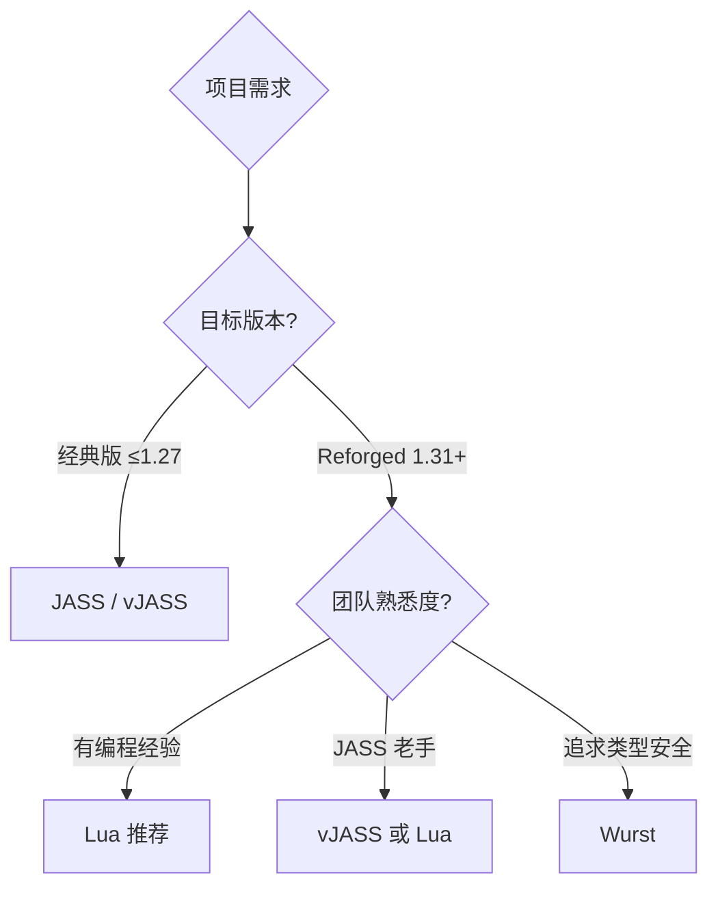

# 02 · 脚本编程

Warcraft III 地图脚本编程：JASS、vJASS、Lua、Wurst。

## 文档列表

- [`脚本语言概览.md`](脚本语言概览.md) — JASS / vJASS / Lua / Wurst 对比与选择
- [`JASS基础.md`](JASS基础.md) — JASS 语法、类型、触发器
- [`Lua编程.md`](Lua编程.md) — Reforged Lua 编程与注意事项
- [`API参考.md`](API参考.md) — 常用原生函数与 BJ 函数分类
- [`内存泄漏与Desync.md`](内存泄漏与Desync.md) — 性能与多人同步陷阱

## 语言选择



| 语言 | 版本 | 优点 | 缺点 |
| --- | --- | --- | --- |
| **JASS** | 全版本 | 官方、稳定、兼容性最好 | 语法陈旧、无面向对象、易泄漏 |
| **vJASS** | 需 JNGP/WEX | 支持结构体、库、作用域 | 需扩展编辑器、编译复杂 |
| **Lua** | Reforged 1.31+ | 现代语法、性能好、面向对象 | 仅 Reforged、需注意 desync |
| **Wurst** | 编译到 JASS | 强类型、现代工具链 | 学习曲线、生态较小 |

## 核心概念

### 触发器模型

```
事件（Event） → 条件（Condition） → 动作（Action）
```

### 游戏对象类型层次

```
handle
├── agent（引用计数）
│   ├── player
│   ├── widget
│   │   ├── unit
│   │   ├── destructable
│   │   └── item
│   ├── trigger
│   ├── timer
│   ├── group
│   ├── force
│   ├── region / rect
│   ├── location
│   ├── effect
│   ├── sound
│   ├── gamecache
│   └── hashtable
└── ...
```

### 锁步（Lock-step）模型

War3 多人游戏采用**锁步同步**：所有客户端运行相同代码，必须产生相同结果。
任何依赖本地状态的操作（`GetLocalPlayer`）都可能导致 **desync**。

## 快速示例

### JASS

```jass
function Trig_Test_Actions takes nothing returns nothing
    local unit u = CreateUnit(Player(0), 'hfoo', 0, 0, 90)
    call SetUnitState(u, UNIT_STATE_LIFE, 100.0)
    set u = null  // 防止泄漏
endfunction
```

### Lua

```lua
function Trig_Test_Actions()
    local u = CreateUnit(Player(0), FourCC("hfoo"), 0, 0, 90)
    SetUnitState(u, UNIT_STATE_LIFE, 100.0)
    -- Lua 无需手动置 nil，但需手动销毁游戏对象
end
```

## 外部资源

- **JassDoc**：https://github.com/lep/jassdoc
- **Jassbot**：https://lep.nrw/jassbot/
- **Lua 指南**：https://www.hiveworkshop.com/threads/a-comprehensive-guide-to-mapping-in-lua.341880/
- **WurstScript**：https://github.com/wurstscript/WurstScript
