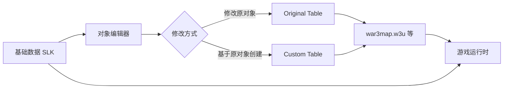

# 03 · 对象数据

对象编辑器（Object Editor）用于修改游戏中的单位、技能、物品等数据。

## 文档列表

- [`对象数据概述.md`](对象数据概述.md) — 对象数据原理与 SLK 基础
- [`单位数据.md`](单位数据.md) — 单位字段详解
- [`技能数据.md`](技能数据.md) — 技能字段与技能系统
- [`物品与升级.md`](物品与升级.md) — 物品、升级、增益

## 对象数据类型

| 类型 | 文件 | 说明 |
| --- | --- | --- |
| 单位 | `war3map.w3u` | Unit |
| 物品 | `war3map.w3t` | Item |
| 技能 | `war3map.w3a` | Ability |
| 可破坏物 | `war3map.w3b` | Destructable |
| 装饰物 | `war3map.w3d` | Doodad |
| 升级 | `war3map.w3q` | Upgrade |
| 增益 | `war3map.w3h` | Buff |

## 对象数据原理

1. 游戏内置基础数据存于 **SLK 文件**（`units/unitdata.slk` 等）。
2. 对象编辑器通过 **对象数据文件**（w3u/w3a...）覆盖或新增。
3. 游戏启动时合并 SLK 基础数据与对象数据。

## 对象 ID 约定

| 前缀 | 类型 |
| --- | --- |
| `h` | Human（人族） |
| `o` | Orc（兽族） |
| `u` | Undead（不死族） |
| `e` | Night Elf（暗夜精灵） |
| `n` | Neutral（中立） |
| `A` | Ability |
| `B` | Buff |
| `R` | Upgrade |
| `I` | Item |
| `D` | Destructable / Doodad |

自定义对象通常使用 `h000`, `h001`... 或 `A000` 等自动生成的 ID。

## 常用工具

| 工具 | 用途 |
| --- | --- |
| Object Editor | 官方对象编辑器 |
| WEX / Sharpcraft | 扩展对象编辑器 |
| **War3Net** | 编程方式读写对象数据 |
| **WC3MapTranslator** | w3u/w3a 等 ⇄ JSON |

## 参考

- WC3MapSpecification：https://github.com/ChiefOfGxBxL/WC3MapSpecification
- War3Net：https://github.com/Drake53/War3Net
