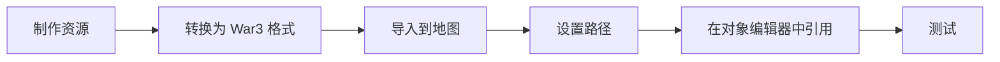

# 05 · 资源制作

自定义模型、贴图、图标、音效的制作与导入。

## 文档列表

- [`资源导入.md`](资源导入.md) — 资源导入流程与路径规范
- [`模型制作.md`](模型制作.md) — MDX/MDL 模型
- [`贴图与图标.md`](贴图与图标.md) — BLP 贴图与图标
- [`音效与UI.md`](音效与UI.md) — 音效、UI 框架

## 资源类型

| 类型 | 扩展名 | 工具 |
| --- | --- | --- |
| 模型 | `.mdx` / `.mdl` | Magos, Retera's Model Studio, 3ds Max + NeoDex |
| 贴图 | `.blp` / `.dds` / `.tga` | BLP Lab, Photoshop + 插件, GIMP |
| 图标 | `.blp` | Button Manager, BLP Lab |
| 音效 | `.wav` / `.mp3` | Audacity |
| 音乐 | `.mp3` | Audacity |
| UI | `.fdf` / `.toc` / `.blp` | 文本编辑器 + 贴图工具 |

## 导入流程



## 路径规范

War3 资源路径使用**反斜杠**，且**大小写敏感**（部分环境不敏感）：

```
units\human\Footman\Footman.mdx
ReplaceableTextures\CommandButtons\BTNFootman.blp
Abilities\Spells\Human\HolyBolt\HolyBoltSpecialArt.mdl
```

### 常见路径前缀

| 路径 | 用途 |
| --- | --- |
| `units\` | 单位模型 |
| `buildings\` | 建筑模型 |
| `Abilities\` | 技能特效 |
| `Doodads\` | 装饰物 |
| `ReplaceableTextures\CommandButtons\` | 命令按钮图标 |
| `ReplaceableTextures\CommandButtonsDisabled\` | 禁用按钮图标（DISBTN） |
| `ReplaceableTextures\PassiveButtons\` | 被动技能图标 |
| `ReplaceableTextures\WorldEditUI\` | 编辑器 UI |
| `UI\` | 界面 |
| `Sound\` | 音效 |
| `Music\` | 音乐 |
| `war3mapImported\` | 导入资源的默认路径 |

## 图标命名规范

| 后缀 | 用途 |
| --- | --- |
| `BTN` | 普通按钮 |
| `DISBTN` | 禁用按钮 |
| `PASBTN` | 被动按钮 |
| `DISPASBTN` | 禁用被动按钮 |
| `ATC` | 攻击类型 |
| `UPG` | 升级 |
| `INFOCARD` | 信息卡 |

示例：`BTNFootman.blp` → `DISBTNFootman.blp`（禁用状态）

## 参考

- Hive Workshop 资源区：https://www.hiveworkshop.com/forums/
- Hive Workshop 3D 建模教程：https://www.hiveworkshop.com/forums/3d-modeling-tutorials.282/
- Hive Workshop 2D 美术教程：https://www.hiveworkshop.com/forums/2d-art-tutorials.281/
