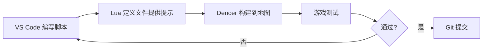

# 脚本开发工具

## 1. VS Code 扩展

### 1.1 Lua（sumneko.lua）

> Lua 语言服务器，提供智能提示、诊断、跳转。

**配置**（`settings.json`）：

```json
{
    "Lua.runtime.version": "Lua 5.3",
    "Lua.workspace.preloadFileSize": 2000,
    "Lua.workspace.maxPreload": 1000,
    "Lua.hint.enable": true,
    "Lua.type.weakUnionCheck": true,
    "Lua.type.weakNilCheck": true,
    "Lua.diagnostics.disable": [
        "lowercase-global",
        "inject-field"
    ],
    "editor.parameterHints.enabled": true,
    "editor.semanticHighlighting.enabled": true
}
```

### 1.2 Dencer.warcraft-vscode

> 直接在 VS Code 中构建 Lua 到地图。

**功能**：
- 从 VS Code 构建 Lua 脚本到 `.w3x`
- 无需手动复制粘贴
- 支持 DebugUtils

### 1.3 wc3-lua-natives

> 跳转到 jassdoc 条目。

**链接**：https://github.com/Tomotz/wc3-lua-natives

### 1.4 Jass API Search

> 悬浮显示 API 文档。

**链接**：https://github.com/toeneeoh/jass-api-search

## 2. API 定义文件

从 Hive Workshop 下载或从游戏导出：

| 文件 | 说明 |
| --- | --- |
| `common.lua` | 原生函数定义 |
| `blizzard.lua` | BJ 函数定义 |
| `CommonAI.lua` | AI 函数定义 |
| `HiddenNatives.lua` | 隐藏原生函数 |

### 2.1 从游戏导出

World Editor → **文件 → 导出脚本**，得到 `war3map.j` 或 `war3map.lua`。

### 2.2 转换 JASS → Lua 定义

使用 [vJass2Lua](https://github.com/BribeFromTheHive/vJass2Lua) 或 [cJass2Lua](https://github.com/goshante/cjass2lua) 转换 `common.j` / `blizzard.j` 为 Lua 定义文件。

## 3. WurstScript

> 编译到 JASS 的现代语言。

**特点**：
- 强类型
- 现代语法
- 优秀 IDE 支持
- 编译产物兼容经典版

**工具**：
- 官网：https://wurstlang.org/
- 仓库：https://github.com/wurstscript/WurstScript
- VS Code 扩展：WurstScript

## 4. vJASS 编译

### 4.1 JNGP

经典版通过 JNGP 编译 vJASS。

### 4.2 vJass2Lua

将 vJASS 转译为 Lua（Reforged）：

- https://github.com/BribeFromTheHive/vJass2Lua

## 5. 调试工具

### 5.1 DebugUtils

Hive Workshop 的调试库，提供：

- 错误捕获
- 日志输出
- 计时器性能分析

### 5.2 日志位置

```
Documents\Warcraft III\Errors\
Documents\Warcraft III\Logs\War3Log.txt
```

### 5.3 游戏内调试

```lua
print("调试信息")
BJDebugMsg("调试信息")
DisplayTextToPlayer(GetLocalPlayer(), 0, 0, "消息")
```

## 6. 版本控制

### 6.1 地图的 Git 管理

地图是二进制文件，直接 Git 管理效果差。推荐：

1. **解包地图**为 `war3map.*` 文件。
2. 用 **WC3MapTranslator** 转为 JSON。
3. 将 JSON 和脚本纳入 Git。

```bash
# 解包
MPQEditor.exe extract MyMap.w3x * ./MyMap_unpacked

# 转 JSON
wc3maptranslator ./MyMap_unpacked --toJson

# Git 管理
git add ./MyMap_json
git commit -m "更新地图数据"
```

### 6.2 脚本开发流程

```
1. 在 VS Code 中编写 Lua/JASS
2. 用 Dencer 扩展或手动导入到地图
3. 测试
4. Git 提交脚本源码
```

## 7. 推荐工作流



## 参考

- Lua 指南：https://www.hiveworkshop.com/threads/a-comprehensive-guide-to-mapping-in-lua.341880/
- WurstScript：https://wurstlang.org/
- JassDoc：https://github.com/lep/jassdoc
