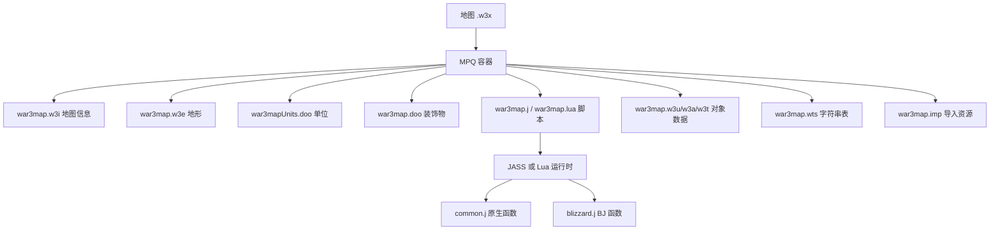

# 📚 War3 地图编辑知识库

本知识库收集 Warcraft III（魔兽争霸3）地图编辑 / Mod 制作相关资料，按主题分目录组织。

> 适用版本：以 **Reforged 1.32+ / 2.0 / 3.0** 为主，同时标注经典版（1.27 / 1.28）差异。

## 目录导航

| 目录 | 内容 |
| --- | --- |
| [`00-入门/`](00-入门/) | 环境搭建、工具安装、第一个地图、术语表 |
| [`01-地图文件格式/`](01-地图文件格式/) | .w3x/.w3m 容器格式、war3map.* 各文件二进制规范 |
| [`02-脚本编程/`](02-脚本编程/) | JASS、vJASS、Lua、Wurst、触发器编程与 API |
| [`03-对象数据/`](03-对象数据/) | 单位/技能/物品/升级/增益 等对象数据（SLK + 对象数据） |
| [`04-触发器与GUI/`](04-触发器与GUI/) | 触发器编辑器、GUI 事件/条件/动作 |
| [`05-资源制作/`](05-资源制作/) | 模型(mdx)、贴图(blp)、图标、音效、UI |
| [`06-工具链/`](06-工具链/) | 第三方编辑器、MPQ 工具、反编译、Lua 转译、脚本注入 |
| [`07-参考/`](07-参考/) | API 参考、常量表、崩溃列表、外部链接汇总 |
| [`99-模板与片段/`](99-模板与片段/) | 可复用的 JASS/Lua 代码模板 |

## 核心概念速览

## 最权威的外部资源

| 资源 | 说明 | 链接 |
| --- | --- | --- |
| **Hive Workshop** | 最大的 War3 mod 社区，教程/资源/工具 | https://www.hiveworkshop.com/ |
| **JassDoc** | JASS API 百科全书（含 bug 注解） | https://github.com/lep/jassdoc |
| **Jassbot** | JASS API 搜索引擎 | https://lep.nrw/jassbot/ |
| **WC3MapSpecification** | war3map.* 文件格式规范 | https://github.com/ChiefOfGxBxL/WC3MapSpecification |
| **WC3MapTranslator** | war3map ⇄ JSON 互转工具 | https://github.com/ChiefOfGxBxL/WC3MapTranslator |
| **Warcraft3-Formats-KaitaiStruct** | Kaitai 结构化的文件格式定义 | https://github.com/WaterKnight/Warcraft3-Formats-KaitaiStruct |
| **WurstScript** | 现代 War3 编程语言 | https://github.com/wurstscript/WurstScript |

## 使用说明

- 文档以 **中文** 撰写，代码、API 名称、文件格式名保留英文。
- 每个文档顶部标注适用范围与版本。
- 引用外部资料时保留原始链接，便于溯源。
- 本知识库持续更新，欢迎补充。
