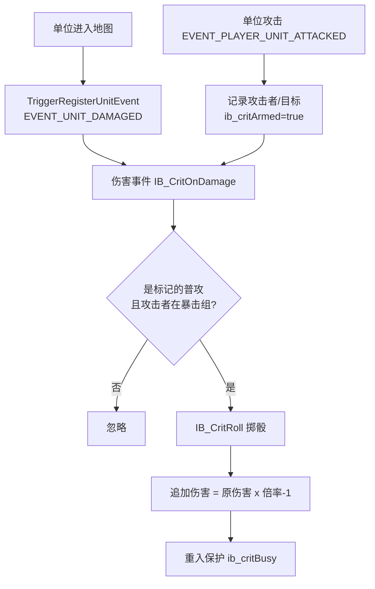

# 致命一击系统（自定义暴击）

在任意 War3 地图中通过聊天命令给**选中的英雄**开启一个自定义暴击技能，
触发时按加权表随机造成 2×~100× 伤害。

## 概率表

| 概率 | 倍数 | 对期望的贡献 |
| --- | --- | --- |
| 50% | 2× | 1.000 |
| 30% | 3× | 0.900 |
| 10% | 4× | 0.400 |
| 4% | 5× | 0.200 |
| 3% | 10× | 0.300 |
| 2% | 50× | 1.000 |
| 1% | 100× | 1.000 |
| **合计** | | **EV = 4.8×** |

- **单次掷骰**：概率加和 = 100%，一次攻击只命中其中一档（100% 会暴击，最低 2×）。
- **期望倍率 4.8×**：即平均每刀造成 4.8 倍伤害（相当于常驻 +380% 攻击力）。

> ⚠️ **平衡提示**：4.8× 的期望非常高，且 50×/100× 两档（仅 3% 概率）贡献了
> 42% 的期望，方差极大。若用于对战地图，建议下调高倍档概率（见下方"调整数值"）。

## 命令

| 命令 | 说明 |
| --- | --- |
| `criton` | 给**当前选中的英雄**开启致命一击 |
| `critoff` | 关闭选中英雄的致命一击 |
| `crit` | 显示概率表与统计信息 |

## 工作原理

War3 1.27 **没有** `EVENT_PLAYER_UNIT_DAMAGED`，因此使用经典 **Damage Engine** 模式：



关键点：

1. **只对普攻生效**：用 `EVENT_PLAYER_UNIT_ATTACKED` 标记"攻击者→目标"，
   下一次同源的伤害事件才结算，避免技能/法术也触发暴击。
2. **重入保护**：追加伤害会再次触发伤害事件，用 `ib_critBusy` 直接忽略。
3. **无需改地图对象数据**：用 `unit group` 记录携带暴击的单位，可在任意地图使用。

## 实现位置

| 文件 | 内容 |
| --- | --- |
| `scripts/item-browser/g.j` | 暴击全局变量（`ib_critGroup` 等） |
| `scripts/item-browser/f.j` | `IB_CritRoll` / `IB_CritOnAttack` / `IB_CritOnDamage` / `IB_CritInit` 等 |
| `scripts/item-browser/m.j` | 入口（`IB_Init` 内调用 `IB_CritInit`） |

## 调整数值

改 `scripts/item-browser/f.j` 中的 `IB_CritRoll`（累计概率阈值）：

```jass
function IB_CritRoll takes nothing returns integer
    local integer r = GetRandomInt(1, 100)
    if r <= 50 then          // 50% -> x2
        return 2
    elseif r <= 80 then      // 再 30% -> x3  (累计 80)
        return 3
    elseif r <= 90 then      // 再 10% -> x4  (累计 90)
        return 4
    elseif r <= 94 then      // 再 4%  -> x5  (累计 94)
        return 5
    elseif r <= 97 then      // 再 3%  -> x10 (累计 97)
        return 97 then ...
```

改完后重新运行：

```powershell
python tools/war3map-injector/build_fj.py
python tools/war3map-injector/inject_map.py "maps/你的地图.w3x"
```

### 推荐方案（降低期望）

若觉得 4.8× 太强，可参考下面两档：

**温和版（EV ≈ 2.93×）**

| 概率 | 倍数 |
| --- | --- |
| 60% | 2× |
| 25% | 3× |
| 10% | 4× |
| 3.5% | 5× |
| 1% | 10× |
| 0.4% | 50× |
| 0.1% | 100× |

**平衡版（EV ≈ 1.6×）**

| 概率 | 倍数 |
| --- | --- |
| 40% | 2× |
| 20% | 3× |
| 10% | 4× |
| 5% | 5× |
| 2% | 10× |
| 0.5% | 50× |
| 0.1% | 100× |

## 已知限制

- **伤害类型**：追加伤害为 `DAMAGE_TYPE_UNIVERSAL` + `ATTACK_TYPE_NORMAL`，
  可无视护甲，但不会触发吸血等"物理伤害"相关效果。
- **多人同步**：`GetRandomInt` 在同步上下文调用，不会 desync。
- **召唤物**：进入地图的单位会自动注册伤害事件，因此召唤物也能暴击（若加入组）。
