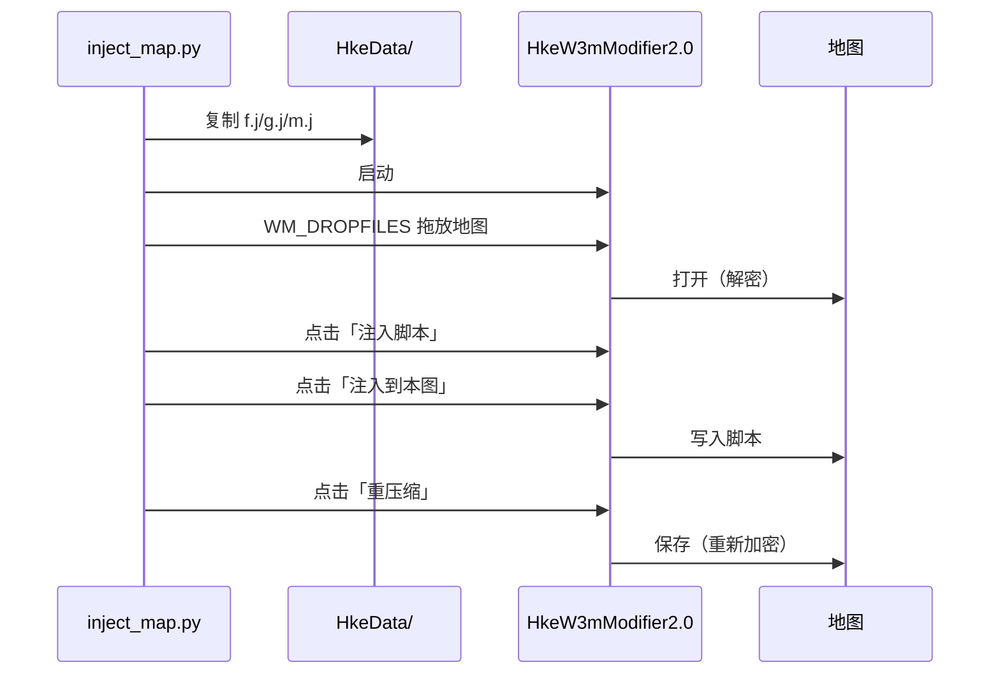

# war3map-injector · War3 地图脚本注入工具

将自定义 JASS 脚本注入到任意 War3 地图（支持加密/保护地图）。

## 背景

War3 地图（`.w3m`/`.w3x`）是 MPQ 归档。官方对战地图（如 Lost Temple）使用
**非标准加密**保护其哈希表与块表，常规 MPQ 库（mpyq、StormLib）无法直接读写。

本工具链利用 **HkeW3mModifier2.0**（可无视已知 MPQ 加密）完成注入，
并用 Python 自动化其 GUI 操作，实现一键注入。

## 文件说明

| 文件 | 说明 |
| --- | --- |
| `inject_map.py` | **一键注入**（推荐）：复制脚本 → 启动工具 → 打开地图 → 注入 → 保存 |
| `war3mpq.py` | Python MPQ 读写库（支持 HM3W 头、表解密探测） |
| `inject.py` | 纯 Python 注入（仅适用于**未加密**地图） |
| `inject.ps1` | PowerShell 启动器（手动操作版） |
| `auto_inject_drop.py` | 拖放打开地图的底层实现（被 inject_map.py 复用） |

## 环境要求

- Windows
- Python 3.8+（`c:/python313/python.exe`）
- **HkeW3mModifier2.0.exe**（位于 `H:\Games\War3\Tools\...`）

## 快速开始

```powershell
# 一键注入（推荐）
python tools/war3map-injector/inject_map.py "maps/LostTemple/LostTemple.w3m" scripts/item-browser
```

输出示例：

```
已备份: maps\LostTemple\LostTemple.w3m.bak
[1] 复制脚本到 HkeData
    f.j -> ...\HkeData
    g.j -> ...\HkeData
    m.j -> ...\HkeData
[2] 启动 HkeW3mModifier2.0
    主窗口: 0x580730
[3] 拖放打开地图
    标题: hkeW3MModifier 2.05(...) 当前文件:LostTemple.w3m
[4] 注入脚本
    插件窗口: 0x1a0860
    弹窗 '...' -> 点击 '确定'
    ✓ 注入成功
[5] 重压缩保存
    ✓ 已保存

=== 完成 ===
地图: maps\LostTemple\LostTemple.w3m
大小: 245087 -> 249123 (+4036)
注入: 成功
```

## 脚本格式

脚本分为三部分（与 HKE 工具约定一致）：

| 文件 | 注入位置 | 内容 |
| --- | --- | --- |
| `g.j` | `globals ... endglobals` 块内 | 全局变量声明 |
| `f.j` | `main` 函数之前 | 函数定义 |
| `m.j` | `main` 函数开头 | 初始化调用 |

### ⚠️ 编码要求（重要）

**War3 1.27 以 GBK(ANSI) 解析地图脚本。** 工作区里的脚本以 **UTF-8** 保存
（便于编辑），但注入前 **必须转换为 GBK**，否则会出现：

- 中文字符串字面量被 GBK 误读
- UTF-8 尾字节落在 `0x81-0xFE` 区间时会「吞掉」后面的引号
- 字符串永不闭合 → **脚本解析失败 → 加载地图后回到选图界面**

`inject_map.py` 的 `stage_scripts()` 已**自动完成 UTF-8 → GBK 转换**，
无需手动处理。若手工复制脚本到 `HkeData`，请务必先转 GBK。

### 示例

**g.j**
```jass
integer array my_data
integer my_count = 0
```

**f.j**
```jass
function MyFunc takes nothing returns nothing
    call BJDebugMsg("Hello")
endfunction
```

**m.j**
```jass
call MyFunc()
```

## 工作原理



### 关键技术点

1. **HM3W 地图头**：`.w3m` 文件开头有 512 字节的地图头，MPQ 头在其后。
2. **表加密**：哈希表/块表可能用 `(hash table)`/`(block table)` 派生密钥加密，
   且密钥类型（HASH_NAME_A/B、FILE_KEY 等）因地图而异，需探测。
3. **拖放打开**：`WM_DROPFILES` 消息可绕过文件对话框，可靠地打开地图。
4. **真实鼠标点击**：Delphi 应用对 `SendMessage(BM_CLICK)` 响应不佳，
   需用 `SetCursorPos` + `mouse_event` 发送真实点击。

## 手动操作流程

若自动化失败，可手动操作：

1. 将 `f.j`/`g.j`/`m.j` 复制到 `HkeData\` 目录。
2. 启动 `HkeW3mModifier2.0.exe`。
3. 把地图**拖入**工具窗口。
4. 点击 **「注入脚本」**。
5. 在插件窗口点击 **「注入到本图」**，确认「注入成功」。
6. 关闭插件窗口，点击 **「重压缩」** 保存。

## 验证注入

注入后，用工具打开地图 → **分析文件** → 选中 `war3map.j` → **解压文件**，
在工具目录或地图目录找到 `war3map.j`，搜索脚本标记：

```powershell
Select-String -Path war3map.j -Pattern "IB_Init"
```

## 常见问题

| 问题 | 解决 |
| --- | --- |
| 工具未启动 | 检查 `TOOL` 路径常量 |
| 地图未打开 | 确认地图路径存在；拖放需要非只读模式 |
| 注入失败 | 查看插件窗口提示；确认 HkeData 中有 f.j/g.j/m.j |
| 重压缩卡死 | 点击「修复MPQ头」后重试 |
| 脚本乱码 | 用插件的「UTF-8转化器」转换编码 |

## 适用范围

- ✅ 官方对战地图（加密）
- ✅ 第三方加密地图
- ✅ 未加密地图
- ✅ `.w3m` / `.w3x`

## 许可与致谢

- **HkeW3mModifier2.0** 由 HKE 开发（2010），用于 MPQ 编辑与脚本注入。
- 本工具链仅用于**学习与个人单机游戏**，请勿用于作弊或侵犯他人作品。
